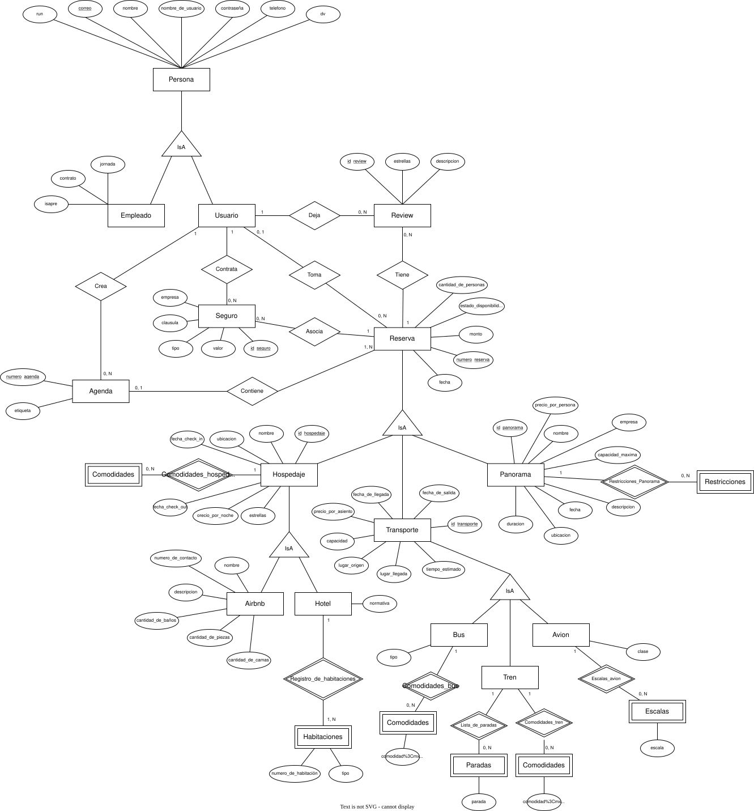

# Entrega 1 - Bases de datos IIC2413

### Datos del Alumno
| **Nombre Completo** | **Número de Alumno** |
|---------------------|----------------------|
| Gonzalo Balladares  |             2262595J |

### Credenciales de acceso

| **Usuario Uc**                  | **Valor** |
|---------------------------------|-----------|
| gballadaresv.uc@bdd1.ing.puc.cl | 2262595J  |

### 1. Modelo E/R 

<!-- Tienes que agregar la ruta de tu imagen donde dice diagrama.png, tiene que ser en formato svg para no perder calidad -->

### 2. Identificación de entidades débiles y justificación

#### 2.1 Entidad

- __Habitacion__: Se dejó como entidad débil ya que depende inherentemente de la existencia de un hotel.

- __Comodidades__: Se deja como entidad débil para relacionarse con __Bus__ o __Tren__ según el caso. También aplica para __Hospedaje__.

- __Parada__: Se crea para agregar una lista de paradas según tren.

- __Escalas__: Mismo criterio que con las paradas.

### 3. Identificación de llaves primerarias/compuesta y justificación

#### 3.1 Persona, Empleado y Usuario

- La llave primaria en __Persona__ es __correo__ ya que según se menciona en el enunciado, las personas se identifican por su correo, lo mismo es cierto para __Empleado__ y __Usuario__, que heredan de __Persona__, con lo que dicho atributo es tanto llave primaria como llave foránea.

#### 3.2 Reserva

- Como llave primaria de __Reserva__ se creó una surrogate key llamada __id_review__ para facilitar la identificación de las tuplas y respetar BCNF.

#### 3.3 Agenda

- De igual manera, se crea un __numero_agenda__ como llave primaria de agenda.

#### 3.4 Seguro

- Como llave primaria de __Seguro__ se creó la surrogate key __id_seguro__ con la misma lógica anterior.

#### 3.5 Review

- Se crea el atributo __id_review__ para usarse como llave primaria.

#### 3.6 Transporte

- Se crea el atributo __id_transporte__.

#### 3.7 Hospedaje

- Se crea el atributo __id_hospedaje__.

#### 3.8 Panorama

- Se crea el atributo __id_panorama__.

### 4. Explicación cardinalidades modelo E/R

#### 4.1 Usuario y Review {1, 0 a n}

Un mismo usuario puede dejar ninguna o varias reviews, pero las reviews pertenecen a sólo 1 usuario.

#### 4.2 Usuario y Reserva {0 o 1, 0 a n}

Un mismo usuario puede tomar ninguna o varias reservas, mientras que las reservas pueden pertenecer a un usuario, o a ninguno.

#### 4.3 Usuario y Agenda {1, 0 a n}

Un mismo usuario puede crear ninguna o varias agendas, mientras que las agendas pertenecen a sólo 1 usuario.

#### 4.4 Usuario y Seguro {1, 0 a n}

Un mismo usuario puede contratar ningún o varios seguros, mientras que cada seguro pertenece a exactamente 1 usuario.

#### 4.5 Review y Reserva {0 a n, 1}

Pueden haber varias reviews de una reserva, así como puede no haber ninguna, pero todas las reviews serán acerca de 1 reserva.

#### 4.6 Seguro y Reserva {0 a n, 1}

Una reserva puede no tener o tener varios seguros asociados a ella, pero todos los seguros estarán asociados a sólo 1 reserva.

#### 4.7 Agenda y Reserva {0 a 1, 1}

Las agendas al ser creadas pueden contener sólo una o varias reservas, mientras que las reservas pueden estar asociadas o no a una única agenda.

#### 4.8 Comodidades y Hospedaje {0 a N, 1}

Cada hospedaje puede tener varias o ninguna comodidad, pero todas las comodidades están asociadas a un hospedaje.

#### 4.9 Hotel y Habitaciones {1, 1 a N}

Un hotel tiene al menos una habitación, y cada habitación pertenece a exactamente 1 hotel.

#### 4.10 Bus y Comodidades {1, 0 a N}

Un bus puede tener ninguna o varias comodidades, y cada comodidad pertenece a un bus en particular.

#### 4.11 Tren y Paradas {1, 0 a N}

Un tren puede tener ninguna o varias paradas, y cada parada es de un tren.

#### 4.12 Tren y Comodidades {1, 0 a N}

Un tren puede tener ninguna o varias comodidades, y cada comodidad pertenece a un tren en particular.

#### 4.13 Escalas y Avión {1, 0 a N}

Un avión puede tener ninguna o varias escalas, y cada escala es de un avión.

#### 4.14 Panorama y Restricciones {1, 0 a N}

Cada panorama puede tener ninguna o varias restricciones, y cada restricción es de un panorama en particular.

### 5. Identificación de jerarquías

En el diagrama se da que la entidad __Persona__ es entidad padre de __Empleado__  y __Usuario__ ya que comparten varios etributos, en particular el correo que es llave primaria.

Asimismo, de __Hospedaje__ heredas __Airnbn__ y __Hotel__, ya que ambos son tipos particulares de hospedaje.

De igual manera ocurre con __Transporte__, del que heredan __Bus__, __Tren__, y __Avión__.

### 6. Esquema Relacional

__Persona__ : (<u>correo</u>: string, nombre: string, run, int, nombre_de_usuario: string, contraseña: string, telefono: int, dv: int)

__Usuario__ : (<u>Persona.correo</u>(FK): string)

__Empleado__ : (<u>Persona.correo</u>(FK): string, jornada: string, contrato: String, isapre: string)

__Review__ : (<u>id_review</u>: serial, estrellas: int, descripcion: string)

__Agenda__ : (<u>numero_agenda</u>: int, etiqueta: string)

__Seguro__ : (<u>id_seguro</u>: serial, empresa: string, clausula: string, tipo: string, valor: int)

__Reserva__ : (<u>numero_reserva</u>: int, cantidad_de_personas: int, estado_disponibilidad: string, monto: int, fecha: date)

__Hospedaje__ : (<u>id_hospedaje</u>: serial, nombre: string, ubicacion: string, fecha_check_in: date, fecha_check_out: date, precio_por_noche: int, estrellas: int)

__Panorama__: (<u>id_panorama</u>: serial, nombre: string, precio_por_persona: int, empresa: int, capacidad_maxima: int, descripcion: string, fecha: date, ubicacion: string, duracion: int)

__Transporte__: (<u>id_transporte</u>: serial, tiempo_estimado: int, lugar_origen: string, lugar_llegada: string, capacidad: int, precio_por_asiento: int, fecha_de_salida: date, fecha_de_llegada: date)

__Airbnb__: (<u>Hospedaje.id_hospedaje</u>(FK): serial, nombre: string, numero_de_contacto: int, descripcion: string, cantidad_de_baños: int, cantidad_de_piezas: int, cantidad_de_camas: int)

__Hotel__: (<u>Hospedaje.id_hospedaje</u>(FK): serial, normativa: string)

__Habitaciones__: (<u>Hotel.id_hospedaje</u>(FK): serial,Numero_de_habitacion: int, tipo: string)

__Bus__: (<u>Transporte.id_transporte</u>(FK): serial, tipo: string)

__Tren__: (<u>Transporte.id_transporte</u>(FK): serial)

__Avion__: (<u>Transporte.id_transporte</u>(FK): serial, clase: string)

__Comodidades__: (comodidad: string)

__Paradas__: (parada: string)

__Escalas__: (escala: string)

### 7. Justificación de tablas de relaciones

#### 7.1 Deja

Representa la relación entre __Usuario__ y __Review__ porque un usuario deja una reseña.

#### 7.2 Toma

Representa la relación entre __Usuario__ y __Reserva__ porque un usuario toma una reserva que existe de antemano.

#### 7.3 Crea

Representa la relación entre __Usuario__ y __Agenda__ porque un usuario crea agendas.

#### 7.4 Contrata

Representa la relación entre __Usuario__ y __Seguro__ porque un usuario contrata un seguro.

#### 7.5 Tiene

Representa la relación entre __Review__ y __Reserva__ porque una reserva tiene reviews.

#### 7.6 Asocia

Representa la relación entre __Seguro__ y __Reserva__ porque cada seguro se asocia a una reserva.

#### 7.7 Contiene

Representa la relación entre __Agenda__ y __Reserva__ porque una agenda contiene reservas.

#### 7.8 Comodidades_hospedaje

Representa la relación entre __Hospedaje__ y __Comodidades__, pues indica cuáles son las comodidades con las que cuenta un hospedaje.

#### 7.9 Registro_habitaciones

Representa la relación entre __Hotel__ y __Habitaciones__, pues indica las habitaciones que componen a un hotel.

#### 7.10 Comodidades_bus

Similar a __Comodidades_hospedaje__ indica las comodidades con la que cuenta un bus.

#### 7.11 Lista_de_paradas

Relaciona un tren con las paradas existentes.

#### 7.12 Comodidades_tren

Similar a __Comodidades_bus__, pero con trenes.

#### 7.13 Escalas_avion

Similar a __Lista_de_paradas__, pero con las escala de un avión.

#### 7.14 Restricciones_Panorama

Relaciona los panoramas con al entidad débil de restricciones.

### 8. Justificación sobre la consistencia del diseño del esquema relacional y normalización en BCNF

Este esquema resuelve los temas de Fidelidad, Redundancia, Anomalías, Simplicidad y Buena elección de llaves primarias porque se representa de manera apropiada el problema con sus restricciones, creando relaciones apra evitar transitividades de forma minimalista, evitando redundancias y favoreciendo la simplicidad, se modelaron todas las restricciones del enunciado bajo la idea que lo simple evita complicaciones, errores y redundancias.